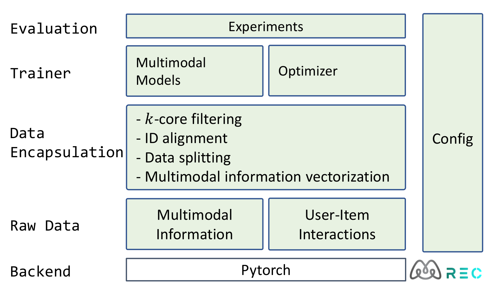

# MMRec

<div align="center">
  <a href="https://github.com/enoche/MultimodalRecSys"></a>
</div>


$\text{MMRec}$: A modern <ins>M</ins>ulti<ins>M</ins>odal <ins>Rec</ins>ommendation toolbox that simplifies your research [arXiv](https://arxiv.org/abs/2302.03497).  
:point_right: Check our [comprehensive survey on MMRec, arXiv](https://arxiv.org/abs/2302.04473).   
:point_right: Check the awesome [multimodal recommendation resources](https://github.com/enoche/MultimodalRecSys).  

## Toolbox
<p>

</p>

## Supported Models
source code at: `src\models`

| **Model**       | **Paper **                                                                                             | **Conference/Journal** | **Code**    |
|------------------|--------------------------------------------------------------------------------------------------------|------------------------|-------------|
| **General models**  |                                                                                                        |                        |             |
| SelfCF              | [SelfCF: A Simple Framework for Self-supervised Collaborative Filtering](https://arxiv.org/abs/2107.03019)                                 | ACM TORS'23            | selfcfed_lgn.py  |
| LayerGCN            | [Layer-refined Graph Convolutional Networks for Recommendation](https://arxiv.org/abs/2207.11088)                                          | ICDE'23                | layergcn.py  |
| **Multimodal models**  |                                                                                                        |                        |             |
| VBPR              | [VBPR: Visual Bayesian Personalized Ranking from Implicit Feedback](https://arxiv.org/abs/1510.01784)                                              | AAAI'16                 | vbpr.py      |
| MMGCN             | [MMGCN: Multi-modal Graph Convolution Network for Personalized Recommendation of Micro-video](https://staff.ustc.edu.cn/~hexn/papers/mm19-MMGCN.pdf)               | MM'19                  | mmgcn.py  |
| ItemKNNCBF             | [Are We Really Making Much Progress? A Worrying Analysis of Recent Neural Recommendation Approaches](https://arxiv.org/abs/1907.06902)               | RecSys'19              | itemknncbf.py  |
| GRCN              | [Graph-Refined Convolutional Network for Multimedia Recommendation with Implicit Feedback](https://arxiv.org/abs/2111.02036)            | MM'20                  | grcn.py    |
| MVGAE             | [Multi-Modal Variational Graph Auto-Encoder for Recommendation Systems](https://ieeexplore.ieee.org/abstract/document/9535249)              | TMM'21                 | mvgae.py   |
| DualGNN           | [DualGNN: Dual Graph Neural Network for Multimedia Recommendation](https://ieeexplore.ieee.org/abstract/document/9662655)                   | TMM'21                 | dualgnn.py   |
| LATTICE           | [Mining Latent Structures for Multimedia Recommendation](https://arxiv.org/abs/2104.09036)                                               | MM'21                  | lattice.py  |
| SLMRec            | [Self-supervised Learning for Multimedia Recommendation](https://ieeexplore.ieee.org/document/9811387) | TMM'22                 |                  slmrec.py |
| **Newly added**  |                                                                                                        |                        |             |
| BM3         | [Bootstrap Latent Representations for Multi-modal Recommendation](https://dl.acm.org/doi/10.1145/3543507.3583251)                                          | WWW'23                 | bm3.py |
| FREEDOM | [A Tale of Two Graphs: Freezing and Denoising Graph Structures for Multimodal Recommendation](https://arxiv.org/abs/2211.06924)                                 | MM'23                  | freedom.py  |
| MGCN     | [Multi-View Graph Convolutional Network for Multimedia Recommendation](https://arxiv.org/abs/2308.03588)                       | MM'23               | mgcn.py          |
| DRAGON  | [Enhancing Dyadic Relations with Homogeneous Graphs for Multimodal Recommendation](https://arxiv.org/abs/2301.12097)                                 | ECAI'23                | dragon.py  |


#### Please consider to cite our paper if this framework helps you, thanks:
```
@inproceedings{zhou2023bootstrap,
author = {Zhou, Xin and Zhou, Hongyu and Liu, Yong and Zeng, Zhiwei and Miao, Chunyan and Wang, Pengwei and You, Yuan and Jiang, Feijun},
title = {Bootstrap Latent Representations for Multi-Modal Recommendation},
booktitle = {Proceedings of the ACM Web Conference 2023},
pages = {845–854},
year = {2023}
}

@article{zhou2023comprehensive,
      title={A Comprehensive Survey on Multimodal Recommender Systems: Taxonomy, Evaluation, and Future Directions}, 
      author={Hongyu Zhou and Xin Zhou and Zhiwei Zeng and Lingzi Zhang and Zhiqi Shen},
      year={2023},
      journal={arXiv preprint arXiv:2302.04473},
}

@article{zhou2023mmrecsm,
  author = {Zhou, Xin},
  title = {MMRec: Simplifying Multimodal Recommendation},
  year = {2023},
  journal={arXiv preprint arXiv:2302.03497},
}
```
